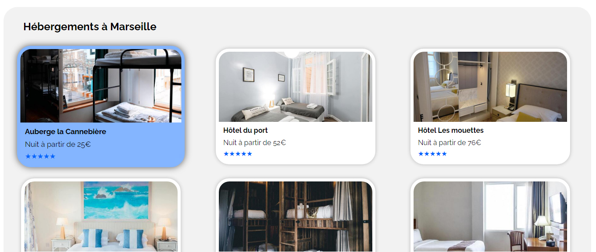

---
presentation:
  width: 1280
  height: 1024
  theme: white.css
  help: true
  controls: true
  progress: true
  history: true
  embedded: true
  mouseWheel: true
---

<!-- slide -->

### Paul Vignon

# Projet 2

## Reservia

<!-- slide -->

# Partie 1
## Présentation du projet fini

<!-- slide -->

<!-- slide -->

_______________________________________________________

<!-- slide -->

_______________________________________________________

<!-- slide -->

<!-- slide -->

# PARTIE 2

- Analyse de la maquette et anticipations

<!-- slide -->

<!-- slide -->

## Difficultés

- Compréhension et maitrise de Flexbox
- Appliquer le responsive avec les Media Queries

<!-- slide -->

## Obtenir de l'aide avec flexbox

<!-- slide -->

## PARTIE 3
- HTML
- CSS
- Responsive

<!-- slide -->

### HTML

<!-- slide -->

## CSS

<!-- slide -->

## Responsive

<!-- slide -->
Des questions ?